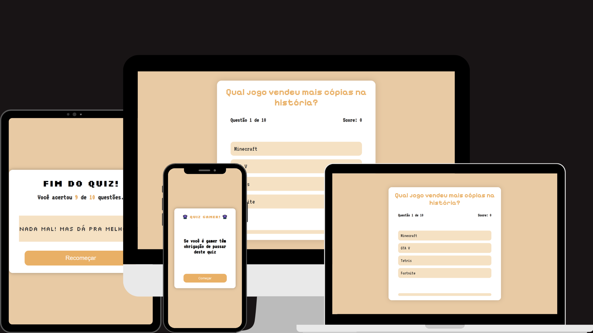

<h1 align="center">🎮 QUIZ GAME 🎮</h1>

###



<h4 align="center"><a href="joao-enrique.github.io/Quiz-game/">Confira o projeto aqui</a></h4>

👾 Bem-vindo ao **Quiz Retrô** — um minigame nostálgico em forma de quiz, com perguntas clássicas do mundo dos games! Teste seus conhecimentos e veja se você é um verdadeiro mestre dos consoles antigos! 🚀

###

<h2 align="left">🕹️ Funcionalidades</h2>

###
- ✅ Quiz com perguntas de múltipla escolha
- ✅ Feedback visual instantâneo (verde = acerto, vermelho = erro)
- ✅ Interface dinâmica em JavaScript
- ✅ Estilo minimalista e retrô
- ✅ Resultado final com pontuação

###

<h2 align="left">🧠 Como funciona?</h2>

###

1. Você inicia o quiz clicando em **Iniciar**.
2. Cada pergunta é exibida com 4 opções.
3. Ao clicar em uma resposta:
    - Ela fica **verde** se estiver certa;
    - Fica **vermelha** se estiver errada;
    - A resposta certa sempre é revelada.
4. Após 1 segundo, a próxima pergunta aparece.
5. No final, você vê sua pontuação!


###


<h1 align="left">💾 Tecnologias utilizadas</h1>

###

<div align="left">
  
  
  
  
  
</div>

###

<h1 align="left">🧪 Como rodar?</h1>

###

<p align="left">1. Faça o clone do projeto:</p>

``` bash
https://github.com/joao-enrique/Quiz-game.git
```

###

<h1 align="left">👨‍💻 Estrutura</h1>

###

📁 quiz-game<br>
├── index.html       # Estrutura principal<br>
├── style.css        # Visual retrô (cores, fontes, layout)
<br>├── script.js        # Toda a lógica do quiz
<br>└── README.md        # Você está aqui!

###

<h1 align="left">🔮 Futuras melhorias</h1>

###

- Sistema de ranking 🏆
- Animações em pixel-art 🎨
- Som retro ao clicar nos botões 🔊
- Timer para respostas 🕒

###

<h1 align="left">📬 Contato</h1>

###

<p align="left">Feito com ❤️ por João Enrique.</p>

###

<div align="left">
  <a href="https://www.instagram.com/joao__dev/" target="_blank">
    
  </a>
  <a href="https://www.linkedin.com/in/joao-enrique-dev/" target="_blank">
    
  </a>
</div>

> “It's dangerous to go alone! Take this quiz.” – The Legend of Zelda

###